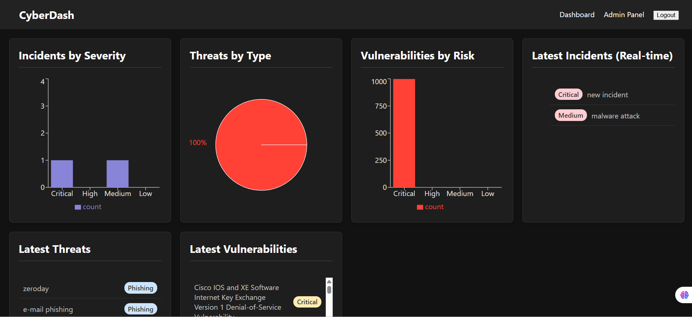
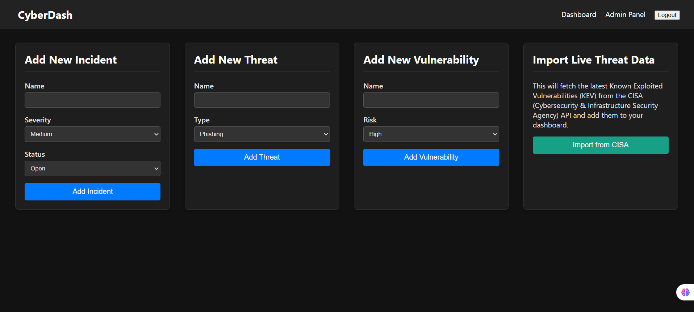

# 🛡️ Cyber Risk Dashboard

A full-stack, real-time cybersecurity dashboard built with React and Supabase. This application provides a live, interactive overview of incidents, threats, and vulnerabilities. It features a secure admin panel for data management and automatically imports live threat intelligence from the CISA (Cybersecurity & Infrastructure Security Agency) API via a serverless edge function.

### ✨ Live Demo
**[https://your-vercel-url.vercel.app](https://cyber-dashboard-nine.vercel.app/vercel.app)**

*(Note: The dashboard will be empty until you log in to the `/admin` panel and add data.)*

---

## 📸 Screenshots

*(screenshot of  main dashboard )*



*(screenshot of  admin panel)*

---

## 🚀 Features

* **Real-Time Dashboard:** Charts and lists update instantly as new data is added to the database, using Supabase Realtime Subscriptions.
* **Secure Authentication:** A private, protected admin panel (`/admin`) for data management, secured by Supabase Auth.
* **Data Visualization:** Uses **Recharts** to create interactive bar and pie charts for:
    * Incidents by Severity
    * Threats by Type
    * Vulnerabilities by Risk
* **Live Threat Intelligence:** A "Import from CISA" button on the admin panel calls a serverless Supabase Edge Function.
* **CORS & Serverless Fix:** The Edge Function acts as a secure "middle-man" to fetch data from the CISA API, bypassing browser-based CORS errors.
* **Dynamic Data Feeds:** Displays real-time lists of the latest incidents, threats, and vulnerabilities.
* **Professional UI:** A responsive, dark-mode theme built with CSS.

---

## 💻 Tech Stack

* **Frontend:**
    * **React (Vite)**
    * **React Router** (for page navigation)
    * **Recharts** (for data visualization)
    * **Supabase Client** (for database and auth)

* **Backend (Serverless):**
    * **Supabase Auth:** User login and session management.
    * **Supabase Database (PostgreSQL):** A live SQL database for storing all risk data.
    * **Supabase Realtime:** Listens for database changes and pushes them to the client.
    * **Supabase Edge Functions (Deno):** A server-side function (`cisa-importer`) to fetch data from the external CISA API.

---

## 🛠️ How to Run Locally

1.  **Clone this repository:**
    ```sh
    git clone [https://github.com/Sushree2707/cyber-dashboard.git](https://github.com/Sushree2707/cyber-dashboard.git)
    cd cyber-dashboard
    ```

2.  **Install Frontend Dependencies:**
    ```sh
    npm install
    ```

3.  **Set up Supabase:**
    * Go to [Supabase.com](https://supabase.com) and create a new project.
    * In the **Table Editor**, create three tables:
        * `Incidents` (with columns: `name` (text), `severity` (text), `status` (text))
        * `Threats` (with columns: `name` (text), `type` (text))
        * `Vulnerabilities` (with columns: `name` (text), `risk` (text))
    * **Important:** **Disable "Row Level Security (RLS)"** on all three tables for this project to work.
    * In **Authentication** -> **Providers**, enable the "Email" provider.
    * Go to **Authentication** -> **Users** and click "Add user" to create your admin login.

4.  **Create `.env` File:**
    * In the root of the `cyber-dashboard` folder, create a file named `.env`.
    * Go to your Supabase project's **Settings > API** and copy your keys:
    ```
    VITE_SUPABASE_URL=YOUR_PROJECT_URL_HERE
    VITE_SUPABASE_ANON_KEY=YOUR_ANON_KEY_HERE
    ```

5.  **Run the Frontend:**
    ```sh
    npm run dev
    ```

6.  **Deploy the Serverless Function:**
    * Install the Supabase CLI: `npm install supabase --save-dev`
    * Log in: `npx supabase login`
    * Link your project: `npx supabase link --project-ref YOUR_PROJECT_ID`
    * Deploy the function: `npx supabase functions deploy cisa-importer`

---

## 🚀 Deployment

This project is deployed in two parts:

1.  **Backend (Edge Function):** The `cisa-importer` function is deployed directly to Supabase using the Supabase CLI.
2.  **Frontend (React App):** The static React site is deployed to **Vercel**.
    * The **Root Directory** is set to `client` (or the root, if you created `vercel.json` in the root).
    * The `VITE_SUPABASE_URL` and `VITE_SUPABASE_ANON_KEY` are added as **Environment Variables** in the Vercel project settings.